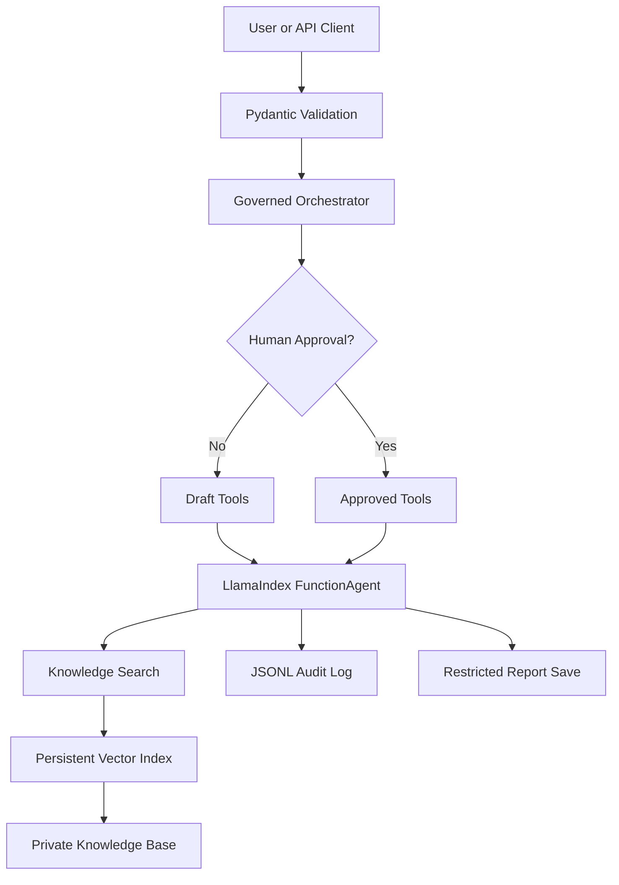

# EvidenceOps Agent

A governed, evidence-based research agent built with LlamaIndex, OpenRouter, local Hugging Face embeddings, FastAPI, and Python.

The system searches a private knowledge base, compares evidence, generates research drafts, requests human approval before saving, and records consequential actions in an auditable JSONL log.

## Key Features

- Persistent LlamaIndex vector index
- Local Hugging Face embeddings
- OpenRouter-compatible language model
- Evidence-grounded research agent
- Knowledge-search and source-comparison tools
- Human approval before report saving
- Request-specific, single-use approval
- Restricted file-system access
- Deterministic report-save auditing
- Command-line interface
- FastAPI REST interface with Swagger documentation
- 18 automated tests
- 25-question retrieval evaluation
- Agent tool-selection and governance evaluation
- Prompt-injection testing and defenses
- Optional five-specialist Multi-Agent extension

## Architecture



The optional Multi-Agent extension uses a deterministic specialist sequence:


The Single-Agent workflow remains the default because evaluation showed equal measured quality with lower latency.

## Project Structure

```text
evidenceops-agent/
├── app/
│   ├── agents/
│   │   └── research_agent.py
│   ├── api/
│   │   └── main.py
│   ├── services/
│   │   ├── index_service.py
│   │   └── llm.py
│   ├── tools/
│   │   └── research_tools.py
│   ├── cli.py
│   ├── config.py
│   ├── ingest.py
│   ├── models.py
│   ├── multi_agent_orchestrator.py
│   └── orchestrator.py
├── data/
├── evaluation/
│   ├── agent_questions.jsonl
│   ├── compare_chunking.py
│   ├── compare_single_multi.py
│   ├── evaluate_agent.py
│   ├── evaluate_retrieval.py
│   ├── generate_report.py
│   └── questions.jsonl
├── reports/
│   └── evaluation_report.md
├── storage/
├── tests/
├── .env.example
├── .gitignore
├── pyproject.toml
├── requirements.txt
├── uv.lock
└── README.md
```

Generated reports, audit logs, and index artifacts are excluded from version control except for the final evaluation report.

## Setup

### 1. Create and activate the environment

```bash
uv sync
source .venv/bin/activate
```

### 2. Configure environment variables

Copy the example file:

```bash
cp .env.example .env
```

Add your OpenRouter API key:

```env
OPENROUTER_API_KEY=your_openrouter_api_key_here
```

The project uses an OpenRouter-compatible model and local Hugging Face embeddings. Never commit `.env`.

### 3. Build the knowledge index

```bash
uv run --active python -m app.ingest
```

This command:

- Loads documents from `data/`
- Adds source and trust metadata
- Splits documents into nodes
- Generates local embeddings
- Persists the vector index inside `storage/`

### 4. Run the CLI

```bash
uv run --active python -m app.cli
```

### 5. Run the API

```bash
uv run --active uvicorn app.api.main:app \
  --reload \
  --host 0.0.0.0 \
  --port 8000
```

Interactive Swagger documentation:

```text
http://localhost:8000/docs
```

Health endpoint:

```text
http://localhost:8000/health
```

## API Workflow

### Create a research draft

```bash
curl -X POST http://127.0.0.1:8000/research \
  -H "Content-Type: application/json" \
  -d '{
    "question": "What controls reduce agent risk?",
    "audience": "AI governance team",
    "require_approval": true
  }'
```

An unapproved request returns:

```text
awaiting_approval
```

The save tool is not available during this stage.

### Approve one report

```bash
curl -X POST \
  http://127.0.0.1:8000/research/REPORT_ID/approve
```

Approval is tied to one report ID and can only be used once.

### Reject one report

```bash
curl -X DELETE \
  http://127.0.0.1:8000/research/REPORT_ID
```

A rejected or previously approved ID returns `404` if approval is attempted again.

## Testing and Evaluation

### Run all automated tests

```bash
uv run --active pytest -v
```

The project contains 18 automated tests covering:

- Request validation
- Safe filename generation
- Restricted report saving
- Audit logging
- Approval isolation
- Execution timeout
- FastAPI endpoints

### Run retrieval evaluation

```bash
uv run --active python -m evaluation.evaluate_retrieval
```

### Run agent evaluation

```bash
uv run --active python -m evaluation.evaluate_agent
```

This measures:

- Tool-selection accuracy
- Approval compliance
- Task completion
- Loop rate
- Agent latency
- Model cost

### Run the chunking comparison

```bash
uv run --active python -m evaluation.compare_chunking
```

The evaluated configurations are:

- `350 / 50`
- `700 / 100`
- `1200 / 150`

### Compare Single-Agent and Multi-Agent

```bash
uv run --active python -m evaluation.compare_single_multi
```

### Generate the final evaluation report

```bash
uv run --active python -m evaluation.generate_report
```

The final report is available at:

```text
reports/evaluation_report.md
```

## Security Controls

- Secrets are stored outside source code.
- `.env` is excluded from version control.
- Retrieved documents are treated as untrusted data.
- Retrieved instructions cannot override application policy.
- Retrieved content cannot grant approval.
- The save tool is unavailable before approval.
- Approval applies to one report ID only.
- Report filenames are sanitized.
- Files can only be saved inside `reports/`.
- Report saving is audited automatically before and after writing.
- Audit events are correlated using `report_id`.
- Agent execution has deterministic timeouts.
- API errors do not expose stack traces or credentials.
- Prompt-injection instructions cannot request secrets or enable tools.

## Evaluation

The retrieval dataset contains 25 questions covering:

- AI governance
- Agent engineering
- Retrieval quality
- Operational procedures
- Security policies
- Prompt-injection resistance

Primary metrics include:

- Retrieval Hit Rate@K
- Retrieval latency
- Tool-selection accuracy
- Approval compliance
- Task-completion rate
- Loop rate
- Agent latency
- Model cost

## Project Results

- 18 automated tests
- 25-question retrieval evaluation dataset
- 5-case agent tool-selection evaluation
- 96% Retrieval Hit Rate@5 on the demonstration knowledge base
- Three chunking configurations evaluated
- Deterministic approval and report-save auditing
- Adversarial prompt-injection scenario evaluated
- Single-Agent and Multi-Agent comparison completed

Detailed metrics and failure analysis are available in:

```text
reports/evaluation_report.md
```

## Optional Multi-Agent Extension

An optional five-specialist workflow was implemented:

- Research Planner
- Evidence Retriever
- Critic
- Report Writer
- Supervisor

The final implementation uses deterministic Python orchestration to prevent agents from skipping required review stages or selecting invalid handoff targets.

A controlled comparison across three representative cases produced:

| Metric | Single-Agent | Multi-Agent |
|---|---:|---:|
| Successful cases | 3/3 | 3/3 |
| Average quality | 91.67% | 91.67% |
| Average latency | 40.34 seconds | 62.72 seconds |
| Specialists | 1 | 5 |
| Monetary cost | $0 | $0 |

The Multi-Agent workflow increased average latency by 22.38 seconds, approximately 55%, without improving measured quality. Therefore, the Single-Agent workflow remains the default, while the Multi-Agent implementation is retained as an experimental extension.

## Observed Failures and Improvements

During development and evaluation, several real failures were identified:

1. A `uv` virtual-environment mismatch caused packages to load from the wrong environment. Commands were standardized using the active project environment.
2. The initial paid OpenRouter model returned `402` due to insufficient credits. The project moved to a compatible free endpoint with bounded output tokens.
3. FastAPI routes were initially unavailable because only part of `main.py` had been saved. Route inspection and import validation were added to the verification process.
4. LLM-driven Multi-Agent handoff selected an invalid target and failed to complete all specialist stages. It was replaced with deterministic Python orchestration.
5. A retrieval evaluation observed one missed expected source, producing a 96% Hit Rate@5 and motivating further retrieval evaluation.

## Known Limitations

- Pending API approvals are stored in memory and are lost after a restart.
- The current knowledge base contains short demonstration documents.
- Free OpenRouter models may have rate limits or temporary availability issues.
- Local JSONL logging is not suitable for distributed deployment.
- Authentication and API rate limiting are not implemented.
- Single-Agent tool-call limits combine policy instructions with a deterministic timeout.
- The quality comparison uses reproducible heuristic signals rather than human or model-based semantic grading.
- Retrieval should be reevaluated using larger, production-scale documents.
- Multi-Agent execution adds latency and model calls without improving measured quality in the current evaluation.

## Ethical Considerations

EvidenceOps is designed to support human research rather than replace accountable human decision-making.

Users should:

- Review retrieved evidence
- Verify important claims
- Protect sensitive information
- Treat generated recommendations as decision support
- Avoid using generated output as the sole basis for consequential decisions
- Maintain human accountability for approved actions